# EconTemple クイックスタートガイド

## このツールについて

**EconTemple**は、コンテ画像からパネル（コマ）を自動抽出し、クリップスタジオペイントで使えるXDTSファイルを生成するツールです。

### 対象ユーザー

このツールは以下の方々を対象としています：

- **制作進行**: コンテをアニメーターに配布する前の整理・データ化作業を効率化
- **演出家/監督**: 描いたコンテをデジタル化し、作画スタッフへの共有を迅速化
- **アニメーター/原画マン**: 受け取ったコンテをクリップスタジオで即座に作画に活用
- **作画監督**: 複数のコンテを管理し、担当者ごとに整理・配布

### 目的

制作進行の手間を減らし、アニメーターがすぐに作画を始められる環境を作ることを目指しています。

**主な利点**:

- コンテの手動切り出し作業を自動化
- カット情報（尺・セリフ・カメラワーク）を一元管理
- クリップスタジオへのスムーズな連携

## インストール

1. `EconTemple.exe` を任意のフォルダに配置
2. 完了

**注意**: 初回起動時、Windows Defenderで実行がブロックされる場合があります。その場合は「詳細情報」→「実行」を選択してください。

---

## 基本的な使い方

このセクションでは、コンテ画像の読み込みから作画開始までの基本ワークフローを説明します。

### ワークフロー概略

以下の5ステップでコンテ画像からクリップスタジオペイント用のデータを作成します：

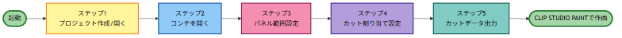

### ステップ1: プロジェクト作成

プロジェクトとは、複数のコンテのグループを管理するまとまりで、このアプリで保存・読み込みするデータファイルの一つの単位です。一つのプロジェクトの中で任意の数のコンテを扱います。

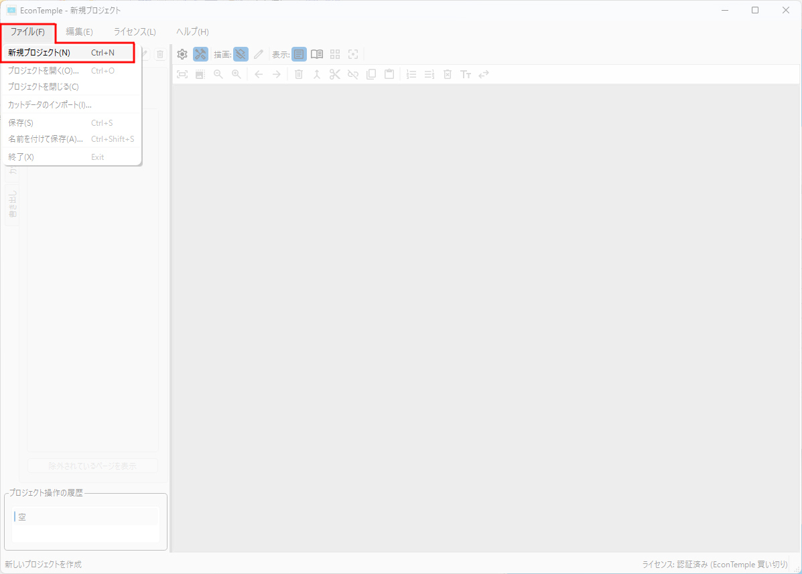

1. 「ファイル」→「新規プロジェクト」を選択
2. 自動的にコンテ画像を読み込むためのダイアログが表示されます（ステップ2に続く）

---

### ステップ2: コンテ画像の読み込み

コンテ画像が保存されたフォルダを指定してアプリにコンテを読み込んで管理します。

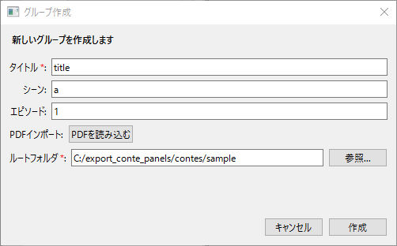

1. 画面左上の「コンテグループヘッダー」の「コンテ追加」ボタン（➕）をクリック
2. ダイアログに必要な情報を入力し「作成」ボタンをクリック
3. 読み込まれたコンテページの一覧が「ページブラウザ」に表示されます
4. ページブラウザでページを選択すると「グラフィック領域」にページが表示されます

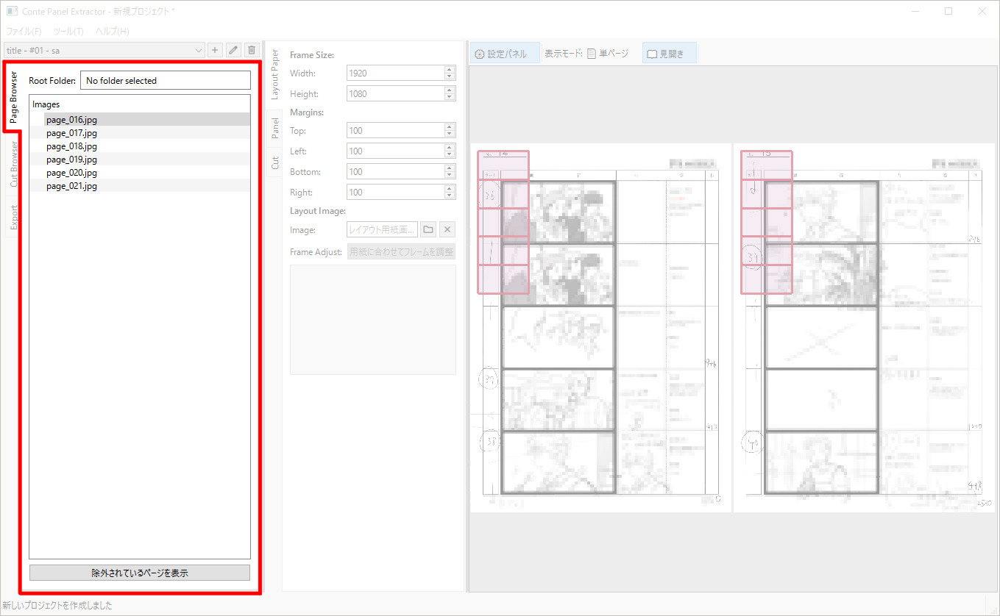

**対応形式**: PNG, JPG, JPEG

#### PDFファイルからの読み込み

PDFファイルのコンテを読み込むこともできます。

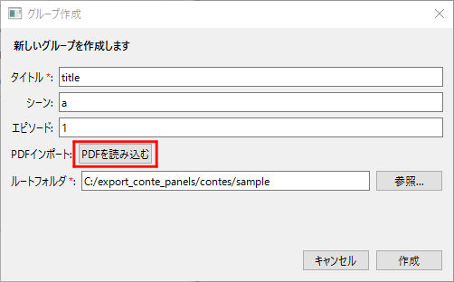

1. 「コンテ追加」ダイアログで「PDFを読み込む」ボタンをクリック
2. PDF変換ダイアログが開きます

   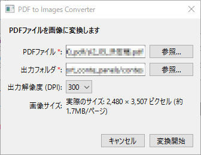

   - **PDFファイル**: 変換するPDFファイルを選択（必須）
   - **出力フォルダ**: 変換後の画像を保存するフォルダを選択（必須）
   - **出力解像度 (DPI)**: 画像の解像度を選択（デフォルト: 300 DPI）
3. 「変換開始」ボタンをクリックしてPDFを画像に変換
4. 変換が完了すると、変換後のフォルダパスが自動的にルートフォルダとして設定されます

**ヒント**:

- PDF変換後のフォルダ名は、PDFファイル名から自動生成されます
- 変換には時間がかかる場合があります
- 複数のコンテグループを追加できます
- ページの一覧は名前順に表示されます

#### 不要なページの除外

フォルダ内に表紙や不要なページが含まれている場合、それらのページを抽出対象から除外することができます。

##### ページを除外する

1. 「ページブラウザ」で除外したいページを選択（複数選択可）
2. 右クリック→「抽出対象から除外」を選択
3. 選択したページが除外され、除外ページリストに移動します

**除外されたページの表示**:

- 除外されたページは薄い赤色の背景で表示されます
- ページブラウザ下部の「除外ページ」ツリーウィジェットに一覧表示されます
- 除外されたページは抽出処理の対象外となります

##### 除外したページを戻す

除外したページを再び抽出対象に含めたい場合：

1. 「除外ページ」ツリーウィジェットで戻したいページを選択（複数選択可）
2. 右クリック→「抽出対象に戻す」を選択
3. 選択したページが通常のページリストに戻ります

**ヒント**:

- 複数ページを一度に除外・復帰できます（Ctrl+クリックまたはShift+クリックで複数選択）
- 除外したページは削除されず、いつでも抽出対象に戻すことができます
- 表紙ページ、メモページ、資料ページなど、抽出不要なページの管理に便利です

---

### ステップ3: パネル設定

パネルはコンテ画像から抽出する領域、及びその領域における100Fの範囲のセットです。抽出領域とレイアウト用紙の設定をすることで、コンテから抽出->サイズ調整が自動化されます。

#### 3-1. 視覚的確認

「グラフィックス領域」でパネルの領域を確認：

- 赤い枠が「抽出領域」（抽出矩形）を示します
- 青い枠は「100Fの領域」（フレーム矩形）を示しています
- ページを切り替えて各ページのパネルを確認

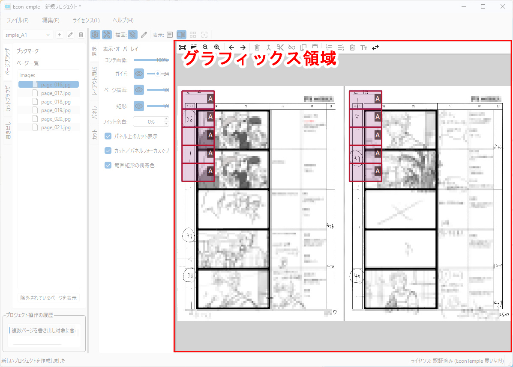

#### 3-2. レイアウト用紙設定

「レイアウト用紙」タブで数値を入力してレイアウト用紙の設定を調整：

- **フレームサイズ**
  - 横幅（Width）
  - 高さ（Height）
- **余白**
「余白」は抽出した画像に余白をつけられるようにするためのものなので、余白が必要ない場合は設定不要です。
  - 上側余白（Top）
  - 左側余白（Left）
  - 下側余白（Bottom）
  - 右側余白（Right）

**Tips**:

- 「レイアウト用紙画像」の「参照」ボタンから実際に使用するレイアウト用紙画像を読み込むことができます
- 「用紙に合わせてフレームを調整」ボタンを押すと「グラフィックス領域」内で視覚的にフレーム範囲の調整ができます

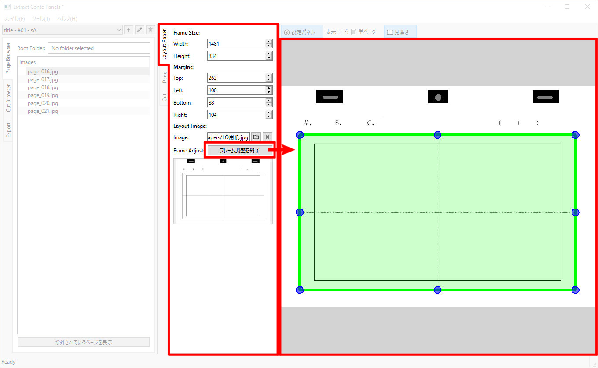

#### 3-3. バッチパネル設定（全ページ共通）

「パネル」タブの「バッチパネル設定」で全ページで共通の基本設定を調整：

- **パネル数**: 1ページあたりのコマ数
- **抽出領域**:
  - 上端位置（Top）
  - 左端位置（Left）
  - 横幅（Width）
  - 高さ（Height）
- **余白**: パネル間のマージン

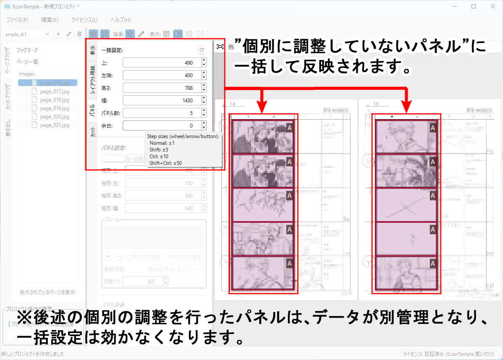

#### 3-4. 個別パネルの調整

ページを開いた状態で、「グラフィックス領域」内でパネルの「抽出範囲」と「フレーム範囲」をモードを切り替えながら調整

##### 3-4-1. パネルの削除

- 「グラフィックス領域」でパネルを選択し「パネル削除」（デフォルトショートカットキー"Delete"（または"x"））

##### 3-4-2. パネルの追加

- 「グラフィックス領域」のパネルが無い場所で右ドラッグ

##### 3-4-3. 抽出範囲の調整

- 「グラフィックス領域」上で操作するパネルを選択して調整
- 選択パネルをドラッグでパネルを移動、ハンドル（青丸）ドラッグで枠を調整
- パネルが選択されている時「パネル」タブの「個別パネル設定」でも調整可

##### 3-4-4. フレーム範囲の調整

- 「グラフィックス領域」上部の「フレーム編集モード」切り替えボタンをオンに切り替え
- 「グラッフィクス領域」でフレーム矩形を選択して抽出範囲と同じ要領で調整

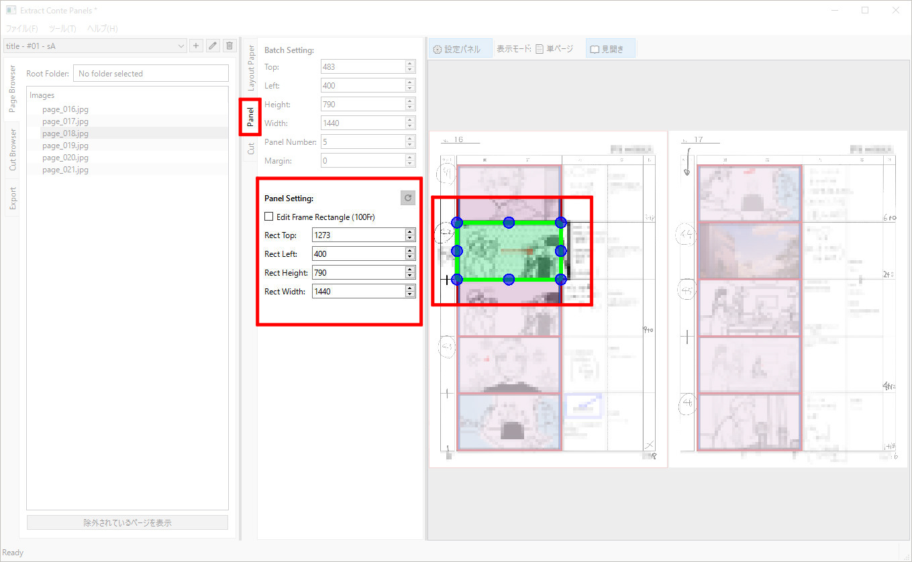

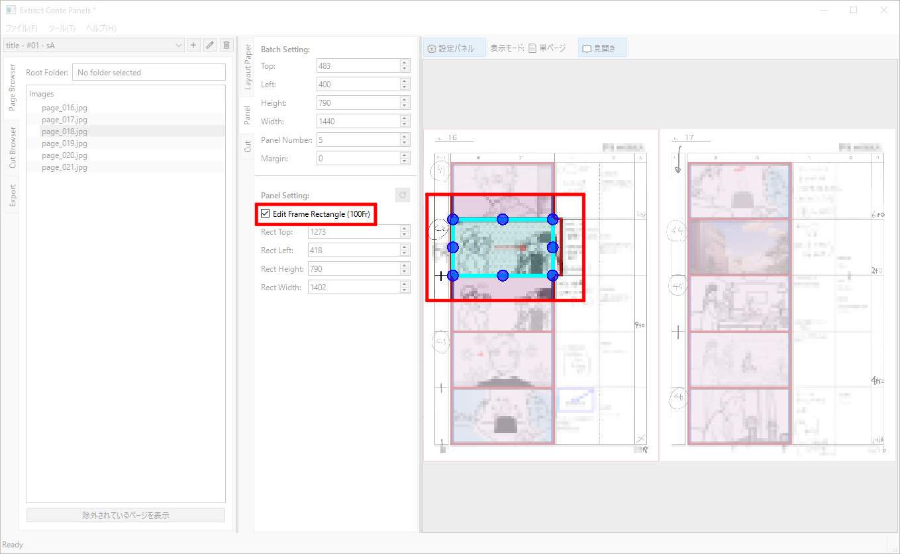

**ヒント**:

- バッチパネル設定で大まかに設定してから、個別調整するのが効率的です。
- ページ切替時に「フレーム編集モード」は自動的にオフになります。

---

### ステップ4: カット作成

パネルをカット情報に紐づけることで、カット単位でフォルダにまとめて抽出することができるようになります。さらに尺・セリフ・カメラワーク・シーン・担当者などの追加情報をセットすることで、整理された状態での一括書き出し・クリップスタジオへの効率的な読み込みを可能にします。

#### 4-1. カット作成

パネルの整理ができたら次はカットデータを設定するために全てのパネルを対応するカット毎にまとめる作業を行います。

- 自動カット割当てを実行
  1. 「カットブラウザ」タブ→「カットリセット」ボタンをクリック
  2. 全てのパネルに自動的にカットが割り振られます
- 手動でカット割当て
複数のパネルを一つのカットとしてまとめる場合、以下の手順でカットを割当てます
  1. 「グラフィックス領域」で同じカットのパネルをすべて選択（ドラッグで範囲選択、またはCtrl+クリックで複数選択）。
  2. ショートカットキーで実行（デフォルトショートカット"C"）
  **自動でカット割当て**:
  手動でカット割当てをするときにグループに一つもカットが存在しない場合、自動的に一度実行されて全てのパネルがカットに割当てられます
- パネルをカットの割当てから独立させる
カットに割り当てられたパネルを再度独立させたい場合：
  1. 「グラフィックス領域」で独立させたいパネルを選択
  2. ショートカットキーで実行（デフォルトショートカット"Shift+C"）
  3. 選択したパネルがカットの割当てから外され、独立したパネルになります
  **ヒント**: パネルを削除せずにカットから外すだけなので、パネル画像は残ります

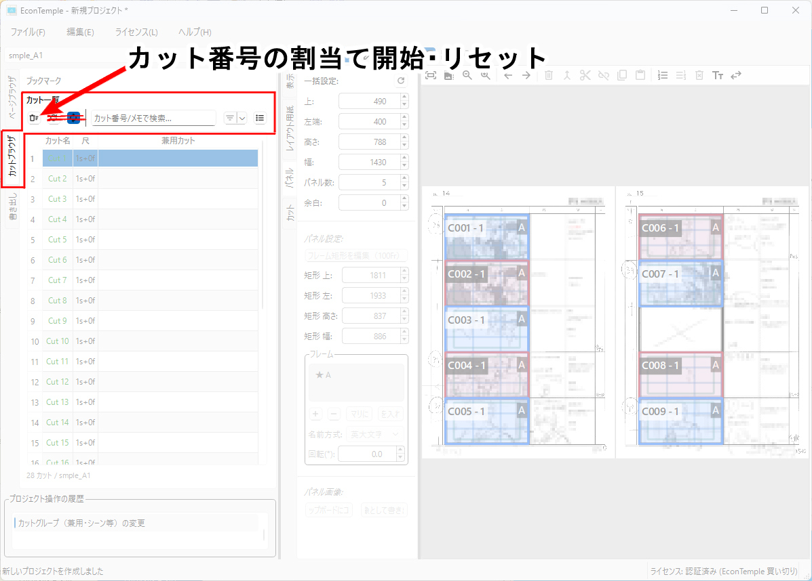

#### 4-2. カット番号割当て

カット番号を個別に入力するのは大変なので、基本的にはカットの順番に自動的に計算をして、必要に応じて個別にカット番号を編集します。

- 全体のカット番号を再計算
  - 「カットブラウザ」タブ→「カット番号再計算」ボタン（更新アイコン）をクリック
  - 全体を通してカット番号が再計算されます
  - カット編集やパネル操作後に、必要に応じて実行することでカット番号の並びを整理することができます
  **ヒント**:
  - カット番号はページ→パネルの位置に基づいて計算されます
- 全カットをリセットして再作成
  - 「カットブラウザ」タブ→「カットリセット」ボタンをクリック
  - 現在のグループの全カットをクリアして、パネルから自動的にカットを再作成します
  - カットの設定を一から作り直したい場合に便利です
  **注意**: カットに関連するデータ（尺、セリフ、カメラワークなど）も全て削除されます
- 範囲を指定してカット番号再計算
  1. 「カットブラウザ」タブで複数カット選択
  2. 右クリックメニューから「カット番号」のメニューを選択
    - 「選択範囲を再番号付け」:
    選択されている先頭のカットから末尾のカットまでをダイアログの入力に基づいて再計算します
    - 「このカット以降を再番号付け」:
     右クリックしたカット以降のカットをダイアログの入力に基づいて再計算します
- カット編集時の自動再計算
カット編集操作（カット作成、パネル削除・追加など）を行うと、編集したカット以降のカット番号が自動的に再計算されます。
**自動再計算が実行される操作**:
  - 「カット」タブでカット番号を編集
  - 「グラフィックス領域」で選択パネルからカット作成（"C"キー）
  - 「グラフィックス領域」でパネルをカットから独立（"Shift+C"キー）
  - 「グラフィックス領域」でパネルを削除

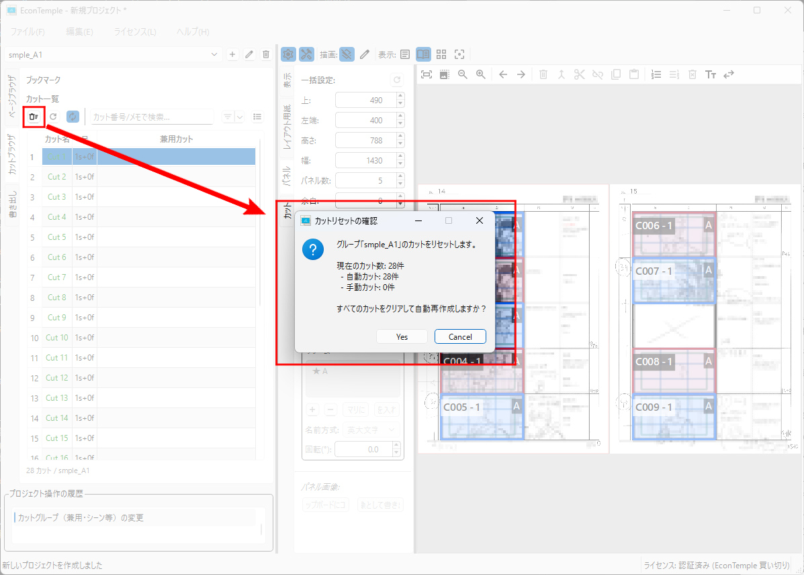

#### 4-3. カットデータの編集

カットのデータを入力しておくことで、xdtsファイルを構成してコンテの情報をクリップスタジオに効率的に読み込むことができるようになります。ショートカットを利用することで連続的にカットの情報を入力していくことができます

- 個別カットのデータ編集
  1. 「カットブラウザ」タブでカットを選択
  2. 「カット」タブで編集：
    - **カット番号**
    「〇〇A」「〇〇B」のような番号もつけることができます。
      - **尺（秒数＋コマ数）**
      **効率的な尺の入力方法**:
        - `Tab`/`Enter`キー: 秒数入力欄 → コマ数入力欄へ移動
        - コマ数入力欄で`Tab`/`Enter`: 次のカットへ自動移動＋秒数入力欄にフォーカス
        - `Shift+Tab`/`Shift+Enter`: 逆方向へ移動
        - `Ctrl+.`: 次のカットへ移動（入力フィールドのフォーカスを保持）
        - `Ctrl+,`: 前のカットへ移動（入力フィールドのフォーカスを保持）
        **Tips**: Tab/Enterキーの連続押下で、全カットの尺を効率的に入力できます
      - **セリフ**
      **効率的なセリフの入力方法**:
    1. `Ctrl+2`キーで「Dialogue」タブに切り替え
    2. 話者・セリフ内容・開始フレーム・尺を入力
    3. `Enter`キーで次の入力欄へ移動（話者→セリフ→開始フレーム→尺）
    4. 尺入力欄で`Enter`: 新規セリフ追加＋話者入力欄にフォーカス
    5. `Ctrl+.`/`Ctrl+,`で前後のカットに移動しながら連続入力
      発言者の自動登録**:
      話者欄で新しい名前を入力すると自動的に登録候補として記憶
      `Ctrl+Space`: 登録済み話者リストをポップアップ表示
      2文字以上入力で自動補完候補を表示
      セリフ尺自動計算機能**:
      セリフ内容の文字数から適切な尺を自動計算
      設定で文字数あたりのフレーム数をカスタマイズ可能
      カメラワーク**
      効率的なカメラワークの入力方法**:
    6. `Ctrl+3`キーで「Camera」タブに切り替え
    7. カメラワーク名・開始フレーム・尺を入力
    8. `Enter`キーで次の入力欄へ移動
    9. `Ctrl+.`/`Ctrl+,`で前後のカットに移動しながら連続入力
      登録されているカメラワーク**:
      カメラワーク名欄で`Ctrl+Space`: 登録済みカメラワークリストをポップアップ表示
      よく使うカメラワーク（例: FIX、PAN、T.U.、T.B.等）は自動補完候補に表示
      新しいカメラワーク名は自動的に登録候補として記憶
- **カット間の効率的な移動**
ショートカットでカットを切り替えて連続的にカットのデータを入力:
  - `Ctrl+.`: 次のカットへ移動
  - `Ctrl+,`: 前のカットへ移動
  - `Ctrl+Tab`: 次のタブ（Panel → Dialogue → Camera）へ切り替え
  - `Ctrl+Shift+Tab`: 前のタブへ切り替え
  - `Ctrl+1`, `Ctrl+2`, `Ctrl+3`: Panel/Dialogue/Cameraタブへ直接切り替え

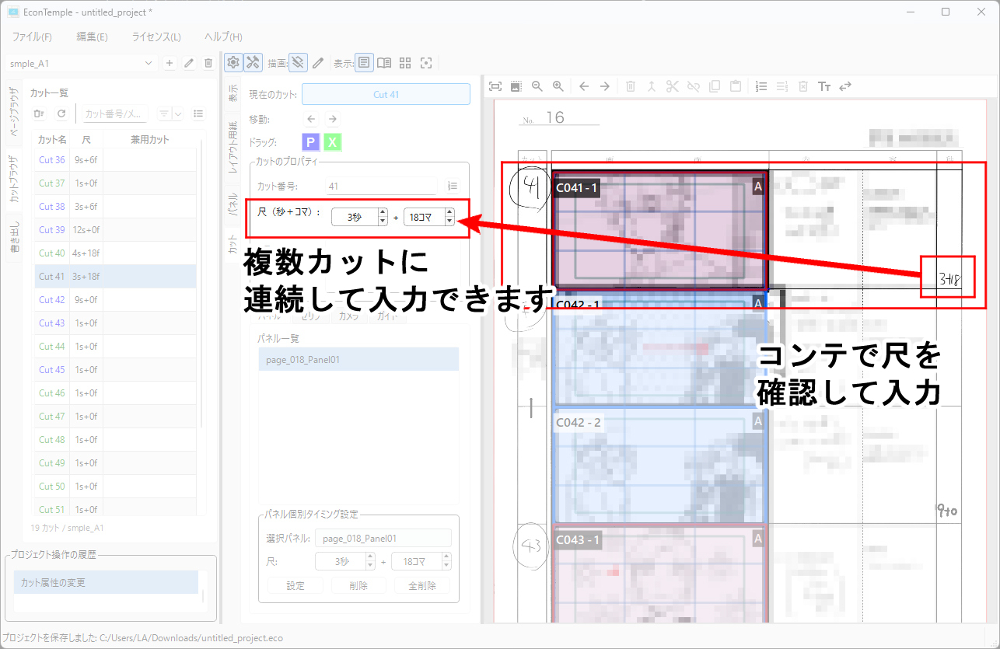

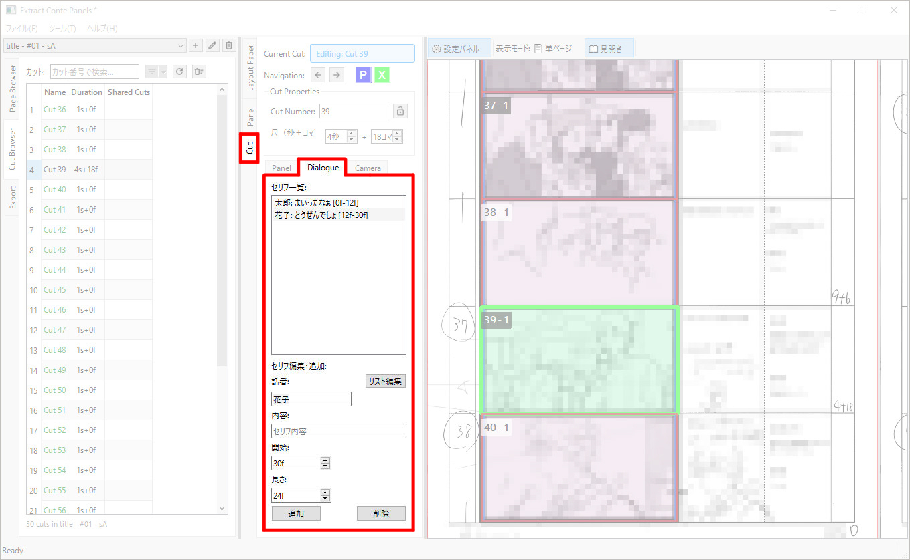

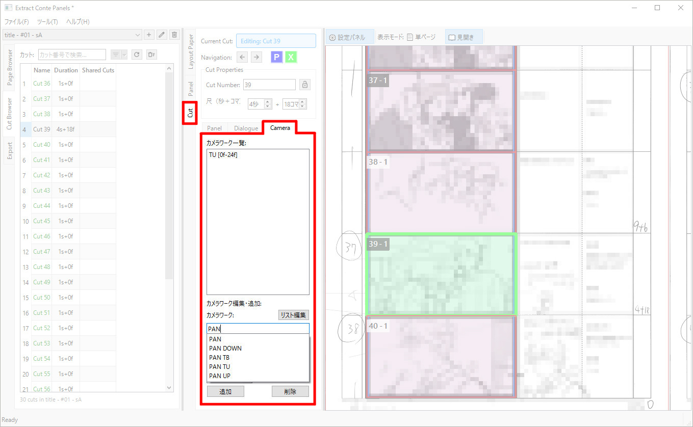

#### 4-4. カットのグループを編集

カットをシーンや担当者でグループ化して管理することで、大規模なプロジェクトでも効率的に作業できます。

##### シーン分け

カットをシーン単位でグループ化し、視覚的に管理できます。

1. **シーン管理を有効化**
  - 「カットブラウザ」でカットを右クリック
  - 「🎬 シーン管理」→「シーン設定を有効化」を選択
  - シーン列がテーブルに表示されます
2. **カットにシーンを割当て**
  - カットを選択（複数選択可）
  - 右クリック→「🎬 シーン管理」→「シーン編集」→「割当を変更」
  - ダイアログでシーン名を入力または既存シーンを選択
  - 複数カット選択時は一括でシーンを割当て可能
3. **シーンの編集**
  - **シーン名を変更**: シーンに割り当てられた全カットのシーン名を一括変更
  - **シーンの色を変更**: シーンごとに色を設定して視覚的に区別
  - シーン列の背景色が自動的に適用されます
4. **シーン境界の調整**
  - 「このカット以降を次のシーンに割当て」: 選択したカットから末尾までの全カットを次のシーンに一括割り当て
  - 「このカットまでを前のシーンに割当て」: 先頭から選択したカットまでの全カットを前のシーンに一括割り当て
   **使用例**: シーンの境界を変更したい場合に便利です
5. **シーンの選択**
  - 「🎬 シーン管理」→「選択」→「同じシーンのカットを選択」: 同一シーンの全カットを自動選択
  - カットブラウザのフィルタ機能でシーン単位の絞り込みが可能

**Tips**:

- シーンごとに色分けすることで、カット表で一目で構成を把握できます
- 書き出し設定で「シーン単位」を選択すると、シーンごとにフォルダ分けして出力できます

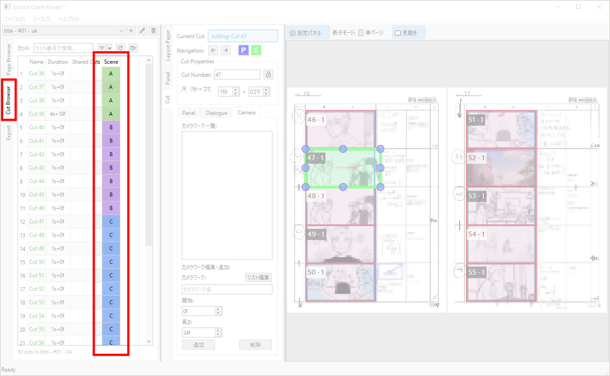

##### 担当者割当て

カットを担当者（アニメーター）ごとに割り当てて管理できます。

1. **担当者管理を有効化**
  - 「カットブラウザ」でカットを右クリック
  - 「👤 担当者管理」→「担当者設定を有効化」を選択
  - 担当者列がテーブルに表示されます
2. **カットに担当者を割当て**
  - カットを選択（複数選択可）
  - 右クリック→「👤 担当者管理」→「担当者編集」→「割当を変更」
  - ダイアログで担当者名を入力または既存担当者を選択
  - 複数カット選択時は一括で担当者を割当て可能
3. **担当者の編集**
  - **担当者名を変更**: 「👤 担当者管理」→「担当者編集」→「担当者名を変更」で、担当者に割り当てられた全カットの担当者名を一括変更
4. **担当者の選択**
  - 「👤 担当者管理」→「選択」→「同じ担当者のカットを選択」: 同一担当者の全カットを自動選択
  - カットブラウザのフィルタ機能で担当者単位の絞り込みが可能
  - 特定の担当者のカットのみを表示して作業効率を向上

**Tips**:

- 担当者ごとに色分けすることも可能（シーンと同様）
- 書き出し設定で「担当者単位」を選択すると、担当者ごとにフォルダ分けして出力できます

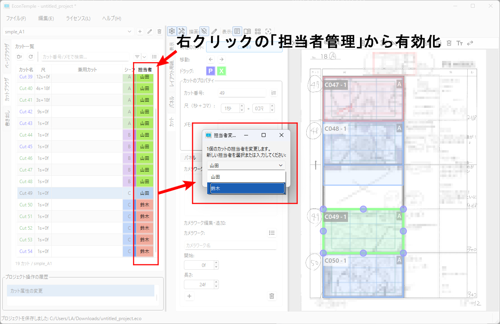

##### 兼用カット

同じ背景や素材を共有する複数のカットをグループ化して管理できます。

1. **兼用カットグループの作成**
  - カットブラウザで関連する複数のカット（2つ以上）を選択
  - 右クリック→「🔗 カット連携」→「兼用カットに設定」
  - 確認ダイアログで「はい」を選択
2. **兼用カットの表示**
  - 兼用カットは紫色（マゼンタ）で表示されます
  - カット名の横に **[兼用]** タグが表示されます
  - 「Shared Cuts」列に関連する他のカットが表示されます（例: Cut 24, Cut 27）
3. **兼用カットの用途**
  - **同じ背景を使うカット**: 同一場所で撮影角度や時間帯が異なるカット
  - **共通アセットの管理**: 使い回す素材を一元管理
  - **制作効率の向上**: 背景やアセットの重複作業を削減

**Tips**:

- 書き出し時に兼用カットの情報を活用して、素材の整理ができます
- 複数のカットで同じパネル画像を参照する場合に便利です

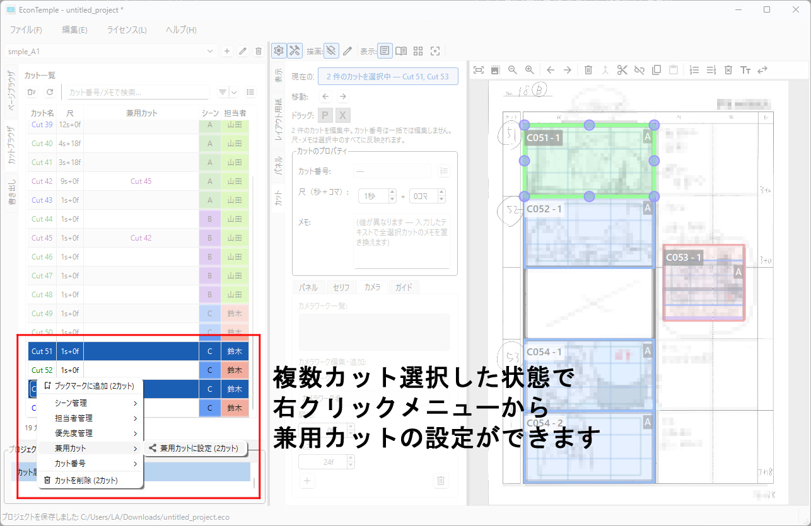

---

### ステップ5: 書き出し

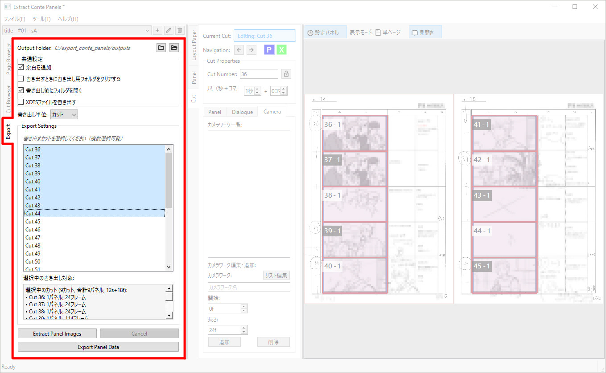

#### 5-1. 書き出し設定

「書き出し」タブを開き、以下を設定：

- **出力フォルダ**: パネル画像とXDTSファイルの保存先
- **共通設定**
  - 余白を追加：書き出したパネルにレイアウト用紙設定で設定されている余白を追加するかどうか
  - 書き出したフォルダをクリアする：書き出す際にすでに書き出されたフォルダ内のデータをクリアするかどうか
  - 書き出し後にフォルダを開く
  - XDTSファイルを書き出す：カット情報からXDTSファイルを構成して保存するかどうか
- **書き出し単位**:
  - 全て
  - ページ
  - カット
  - シーン（シーン設定が有効化されている場合）
  - 担当者（担当者設定が有効化されている場合）

#### 5-2. 書き出し

- パネル画像の書き出し
  1. 「書き出し」タブを開く
  2. 「抽出実行」ボタンをクリック
  3. 進捗バーで処理状況を確認
  4. 完了！
- パネルデータを書き出し
作成したパネルに関するデータをzipファイルとして指定されたフォルダに保存する
「ファイル」→「パネルデータのインポート」でこのzipファイルを指定して、書き出したパネルデータの共有できます

#### 5-3. 出力結果の確認

出力フォルダに以下が生成されます：

```ex
output/
├─ cuts/
│  ├─ Cut_01/
│  │  ├─ Panel01.jpg          # パネル画像
│  │  ├─ Panel02.jpg
│  │  ├─ Cut_01.xdts           # タイムライン情報
│  │  ├─ Cut_01_dialogue.txt   # セリフ一覧
│  │  └─ Cut_01_camera.txt     # カメラワーク一覧
│  ├─ Cut_02/
│  └─ ...
└─ panels/                      # 全パネル（個別出力の場合）
```

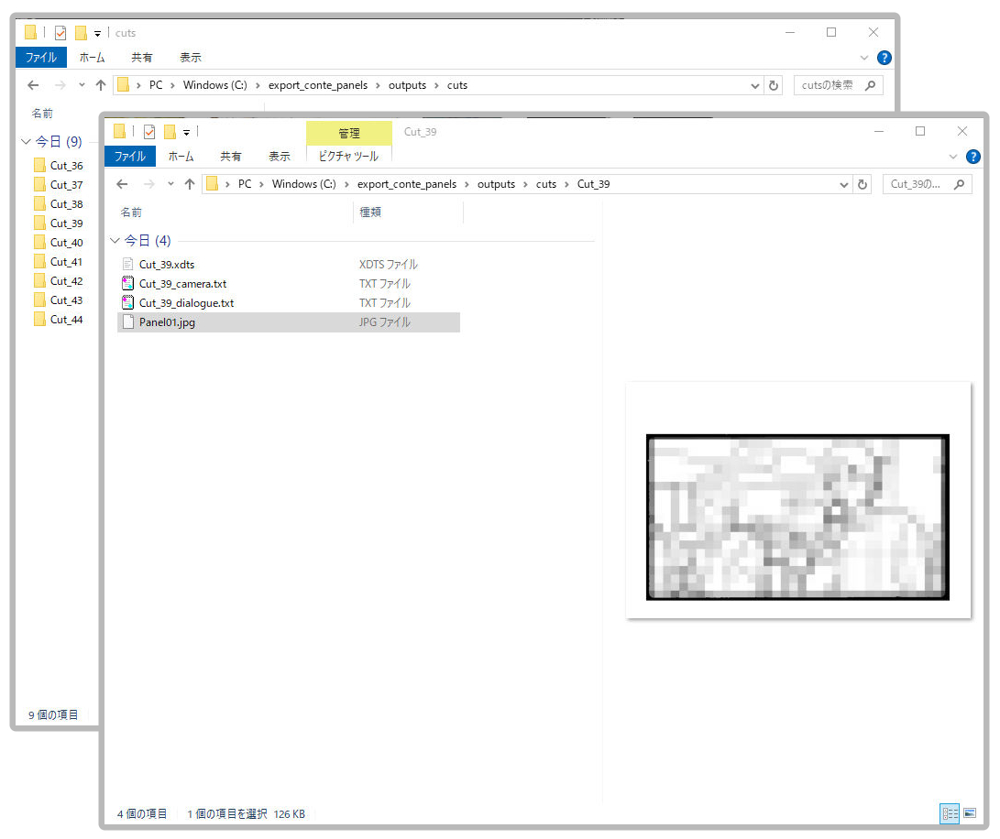

---

## クリップスタジオペイントでの使い方

カット毎のクリップスタジオペイントで作画作業をするためのファイルを用意します

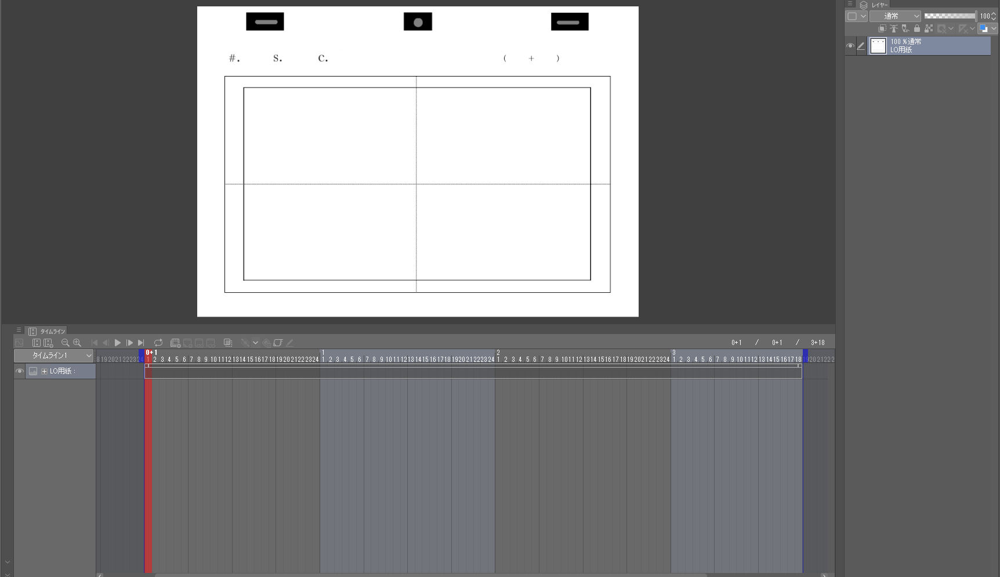

### 🚀 効率的な連携方法: ドラッグ&ドロップ

**EconTempleの最も強力な機能の一つ**:

従来の書き出し→読み込みのワークフローを飛び越えて、カットタブから直接クリップスタジオペイントにデータを送り込むことができます。

#### ドラッグボタンの使い方

カットタブの上部にある2つのドラッグボタンを使用します：

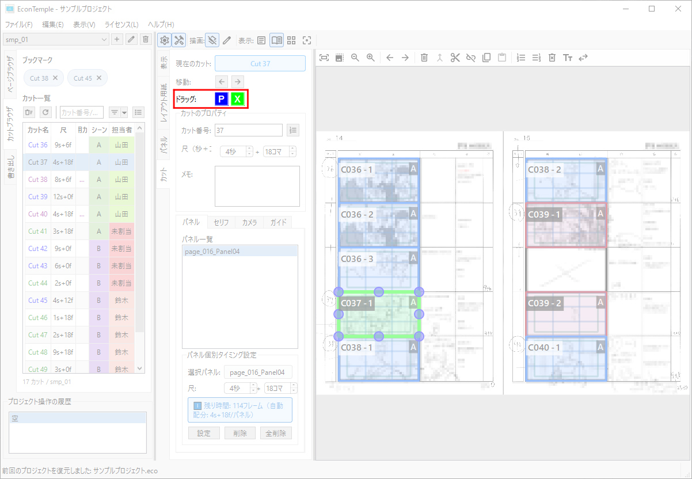

1. **Pボタン（青）- パネル画像をドラッグ**
  - 選択中のカットのパネル画像リストを直接ドラッグ
  - クリップスタジオペイントのレイヤーウィンドウにドロップ
  - 即座にレイヤーとして読み込まれます
2. **Xボタン（緑）- XDTSファイルをドラッグ**
  - 選択中のカットのXDTS（タイムライン）ファイルをドラッグ
  - クリップスタジオペイントのキャンバス部分にドロップ
  - タイムラインに即座にタイミング情報が読み込まれます

#### メリット

- ✅ **書き出し作業が不要**: ファイル保存の手順を完全にスキップ
- ✅ **即座に作業開始**: ワンアクションで素材を配置
- ✅ **リアルタイム連携**: 設定変更後すぐに再ドラッグ可能
- ✅ **ディスク容量節約**: 中間ファイルを作成しない

**推奨ワークフロー**:

1. カットタブでカットを選択
2. 「P」ボタンをクリップスタジオのレイヤーウィンドウにドラッグ
3. 「X」ボタンをクリップスタジオのキャンバスにドラッグ
4. 即座にアニメーション作業を開始！

---

### 従来の方法: ファイルの書き出しと読み込み

ドラッグ&ドロップが使用できない環境や、ファイルとして保存が必要な場合は、以下の従来の方法を使用します。

#### XDTSファイルの読み込み

1. クリップスタジオで作画用のファイルを開く
2. タイムラインが有効化されていることを確認
3. 「ファイル」→「読み込み」→「タイムライン」を選択
4. 出力フォルダの`.xdts`ファイルを選択
5. タイムラインにタイミング情報が読み込まれます

**Tips**:

キャンバス部分にXDTSファイルをドロップして読み込むこともできます

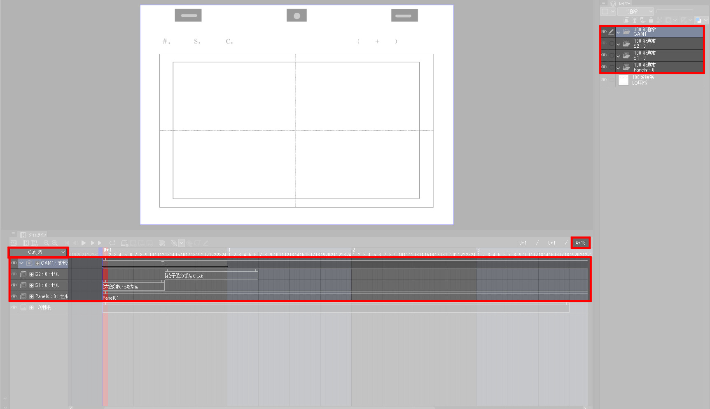

#### パネル画像の読み込み

1. クリップスタジオで作画用のファイルを開く
2. 「ファイル」→「読み込み」→「画像」を選択
3. 出力フォルダのパネル画像をすべて選択
4. レイヤーとしてパネル画像が読み込まれます

**Tips**:

- レイヤーウィンドウ部分に画像ファイルをまとめてドロップして読み込むこともできます
- クリップスタジオのファイルの「編集」→「キャンバス基本設定」の基準サイズと、EconTempleのレイアウト用紙設定のフレームが合っていれば、自動的にスケールされているので位置を調整するだけでそのまま素材を使用できます

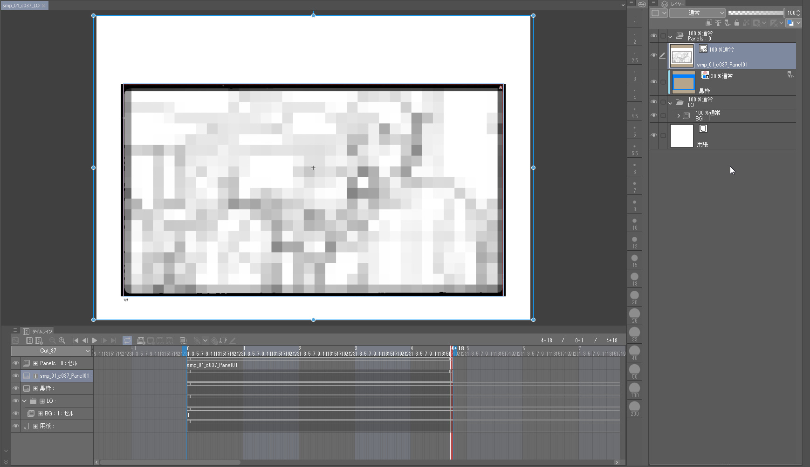

#### レイヤー順の調

1. 読み込んだパネル画像のレイヤーを全てXDTSを読み込んだときに作成されるパネル画像用のアニメーションフォルダに移動
2. これでExtractContePnales上で設定されたパネルのタイミングでタイムライン上にパネルを配置することができ、即座にプレビューできます

---

## よくある質問（FAQ）

📝 **準備中**

以下のトピックに関するFAQを準備中です：

- 起動・インストールに関する問題
- 画像読み込みのトラブル
- パネル抽出位置の調整方法
- XDTSファイルの互換性
- パフォーマンス改善

ご質問がある場合は、[サポート](#サポート)セクションをご確認ください。

---

## トラブルシューティング

📝 **準備中**

以下のトピックに関するガイドを準備中です：

- クラッシュ・強制終了時の対処法
- データ復旧方法
- パフォーマンス最適化
- エラーログの確認方法

問題が発生した場合は、[サポート](#サポート)セクションから直接お問い合わせください。

---

## 用語集

### アニメーション制作用語

**コンテ（絵コンテ）**:

- アニメーションの設計図となる絵と文字で構成された資料
- カメラワーク、セリフ、尺などの演出情報を含む

**パネル / コマ**:

- コンテページ内の個別の絵の単位
- このアプリでは、コンテページから抽出する1つ1つの領域を指す

**カット**:

- 映像の最小単位。1つのカメラアングルで撮影される連続したシーン
- 複数のパネルで構成されることもある

**尺（しゃく）**:

- カットやシーンの長さ（時間）
- 「秒数＋コマ数」形式で表現（例: 2秒+8コマ）

**100F（フレーム）**:

- アニメーション用紙の作画範囲を示す枠
- フレーム矩形、レイアウト枠とも呼ばれる

**シーン**:

- 同じ場所・時間で展開される一連のカットのまとまり
- このアプリでは、カットをグループ化する管理単位

**兼用カット**:

- 同じ背景や素材を共有する複数のカット
- アセットの重複作業を削減するための管理機能

### このアプリケーション固有の用語

**抽出領域（抽出矩形）**:

- コンテページから切り出すパネルの範囲
- 赤い枠で表示される

**フレーム領域（フレーム矩形）**:

- パネル内の100F（作画範囲）を示す領域
- 青い枠で表示される

**レイアウト用紙**:

- アニメーション制作で使用される標準サイズの用紙設定
- フレームサイズと余白を定義

**バッチパネル設定**:

- 全ページに共通で適用されるパネル抽出の基本設定
- パネル数、位置、サイズ、余白などを一括で設定

**個別パネル設定**:

- 特定のパネルに対してバッチ設定を上書きする設定
- ページごと、パネルごとにカスタマイズ可能

**グループ（コンテグループ）**:

- 関連するコンテページをまとめる管理単位
- プロジェクト内で複数のグループを作成可能

**XDTS（エックスディーティーエス）**:

- クリップスタジオペイントで使用されるタイムライン情報ファイル
- カットの尺やタイミング情報を保存

---

## ショートカットキー

- 「編集」→「ショートカット編集」をクリック
- 利用可能なショートカットの一覧と割当て、簡単な説明が確認できます

---

## サポート

### 問題が解決しない場合

1. **Discord**: [招待リンク]（テスター専用チャンネル）
  - リアルタイムの質問・相談
  - 他のテスターとの情報交換
2. **メール**: [beta-test@yourmail.com](mailto:beta-test@yourmail.com)
  - 個別のサポート依頼
  - 機密情報を含む相談

### バグ報告のお願い

バグを発見した場合、以下の情報を添えて報告してください：

- **現象**: 何が起きたか
- **再現手順**: どう操作したら発生するか
- **環境**: OS、PCスペック、ツールバージョン
- **スクリーンショット**: エラーメッセージやログ

詳しくはDiscordの「**バグ報告**チャンネル」をご確認ください

---

## 次のステップ

### より詳しく学ぶ

- 📖 **詳細マニュアル**（準備中）
- 🎥 **チュートリアル動画**（準備中）
- 💡 **Tips集**（準備中）

### サンプルプロジェクト

`samples/`フォルダにサンプルプロジェクトが用意されています：

1. `sample_project.cpe`を開く
2. 各設定を確認
3. 「抽出実行」を試してみる
4. `expected_output/`フォルダと結果を比較

---

## フィードバックのお願い

このツールをより良くするため、ぜひフィードバックをお寄せください：

- ✅ 使いやすかった機能
- ❌ 使いにくかった機能
- 💡 追加してほしい機能
- 🐛 見つけたバグ

**皆様の声が、このツールを育てます！**

---

## バージョン情報

- **バージョン**: 0.9.0 (β版)
- **リリース日**: 2026-XX-XX
- **有効期限**: 2026-XX-XX（60日後）

---

**EconTemple開発チーム**