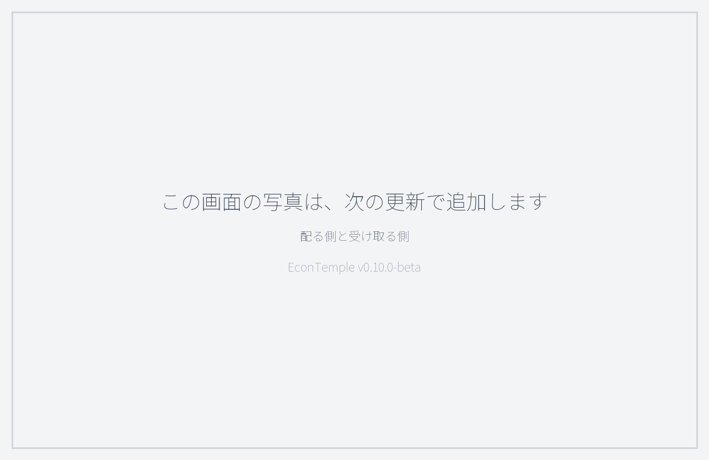
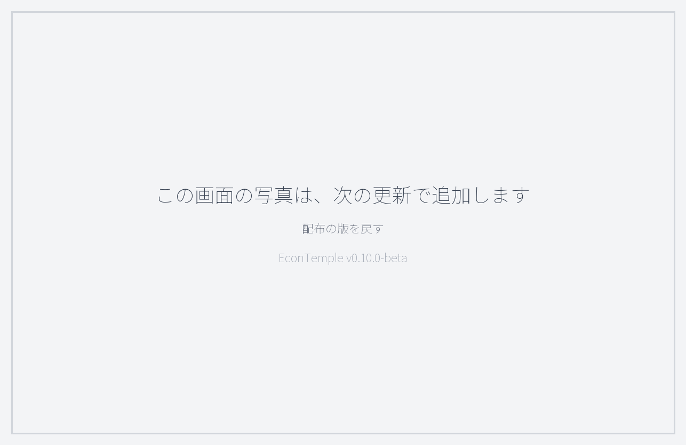
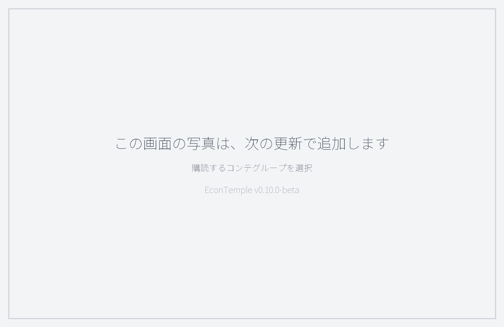
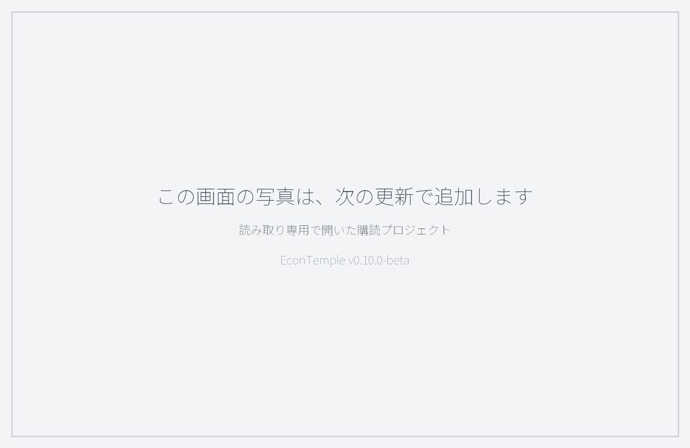
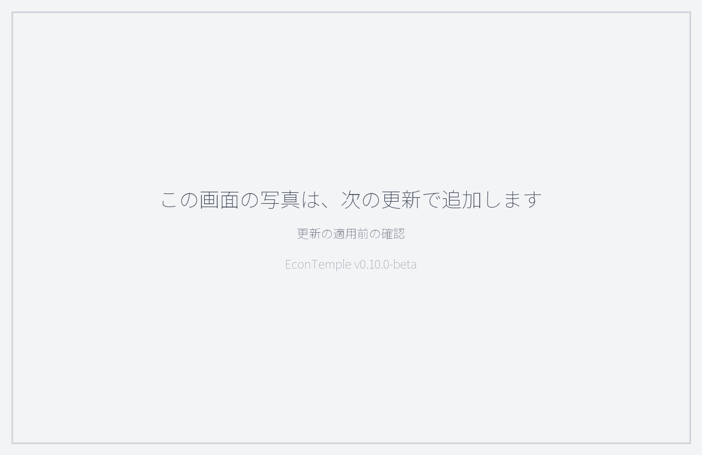

# プロジェクトを配る・受け取る（共有）

制作進行などの**配る側**が整えたプロジェクトを、作画スタッフなどの**受け取る側**へ配り、その後の更新も届けるためのガイドです。

- **受け取る側は、ライセンス認証なしで使えます**。配られたプロジェクトは、無料版の規模の制限（コンテグループ 5 個・カット編集 20 個／グループ）も受けません。
- 受け取る側だけの方は、[1. しくみ](#1-しくみ) と [3. 受け取る側の手順](#3-受け取る側の手順) を読めば足ります。
- 操作はすべてメニュー **「共有」** から行います。

アプリの基本操作は [QuickStart.md](./QuickStart.md) を参照してください。

---

## 1. しくみ

### 1.1 配る側と受け取る側

- **配る側（発行元）**: 手元のプロジェクトを「共有」メニューから公開します。公開した内容が、受け取る側に届く**公式データ**になります。
- **受け取る側**: 公開されたものを取り込み、手元のフォルダに**コピーを展開**して開きます。取り込んだプロジェクトは**購読プロジェクト**と呼ばれ、ウィンドウのタイトルに **「［読み取り専用・購読］」** と表示されます。

データの流れは、配る側から受け取る側への**一方向**です。受け取る側の変更が配る側へ戻ることはありません。

### 1.2 配り方は2つ（配布フォルダ／共有 ZIP）

| | 配布フォルダ | 共有 ZIP |
|---|---|---|
| 渡し方 | Google ドライブなどの共有フォルダを配布フォルダにして、そこへ公開する | 1つの ZIP ファイルに書き出して手渡しする |
| 更新 | 版を重ねて公開でき、受け取る側は更新を確認して適用できる | 単発。取り込んだあとの更新は届かない |
| 版を戻す・更新履歴 | できる | できない |
| 向く場面 | 制作中に内容が変わり続けるプロジェクト | 一度渡せば済むとき・オフラインで渡すとき |

どちらの場合も、受け取る側は**取り込むコンテグループを選べます**（担当外の話数を外すと軽くなります）。

### 1.3 受け取った側で変えられるもの

| 受け取ったプロジェクトのデータ | 受け取る側での扱い |
|---|---|
| コンテグループ・ページ・パネル・カット（番号・尺・メモ・パネル割当）・シーン／担当者・兼用カット・カメラワーク・セリフ・レイアウト用紙・一括パネル設定 | **読み取り専用**（直すときは配る側で直して公開し直します） |
| 書き出し設定・コンテ用紙設定 | **変えられます**。更新を適用しても上書きされません |
| ブックマーク・カット別のガイド・ガイドのプリセット | **変えられます**。更新を適用しても残ります |
| カットフォルダとして書き出す | **できます** |

---

## 2. 配る側の手順

公開は、いま開いているプロジェクトの**画面上の状態**をそのまま使います（保存していない変更も含まれます）。公開は保存とは別の操作で、自動では行われません。

### 2.1 配布フォルダへ公開する

1. 配布に使う共有フォルダ（Google ドライブのデスクトップ同期フォルダなど）の中に、**このプロジェクト専用の空のフォルダ**を1つ用意する
2. メニュー **「共有」** → **「配布フォルダへ公開」**
3. 用意したフォルダを選ぶ（選んだフォルダがそのまま配布フォルダになります）
4. 更新コメント（任意）を入力して OK
   - 初回は「新しい配布フォルダとして版 1 を公開します。」と表示されます
5. 「版 1 を公開しました。」と、公開先・コンテグループ数が表示されれば完了です

配布フォルダには、版の履歴・版ごとのデータ・コンテグループごとにまとめた画像が置かれます。**中のファイルを直接編集しないでください**。受け取る側に配布フォルダの場所を伝えます。

### 2.2 更新を公開する

内容を直したら、2.1 と同じ手順で**同じ配布フォルダ**を選んで公開します。

- 「既存の配布フォルダに版 2 を追加します。」のように表示され、版が1つ進みます
- 画像が変わったコンテグループだけが新しく置かれ、変わっていないグループは前の版のものが使われます
- 受け取る側には新しい版として届きます。**受け取る側が適用するまで、相手の手元は変わりません**
- 配布フォルダには直近の版（既定 5 版）の中身だけが残り、それより古い版は履歴だけになります

### 2.3 配布の版を戻す

誤った内容を公開してしまったときは、過去の版の内容を**新しい版として公開し直せます**。

1. **「共有」** → **「配布の版を戻す」**
2. 配布フォルダを選ぶ
3. 戻したい版を選ぶ（中身が残っている過去の版だけが候補に出ます）
4. 更新コメント（初期値は「版 3 へ戻し」のような文）を確かめて OK

- 版の番号は減りません。例: 版 5 のあとに版 3 へ戻すと、版 3 の内容が版 6 として公開されます
- 受け取る側は、ふつうの更新として受け取ります
- 戻るのは配布フォルダの中身だけです。**配る側の手元のプロジェクトは戻りません**

### 2.4 配布の更新履歴を見る

**「共有」** → **「配布の更新履歴」** で、版・公開日時・更新コメント・コンテグループ数・戻し元の一覧を見られます（新しい版が上）。

- 配る側は、配布フォルダを選んで開きます
- 受け取る側（配布フォルダから取り込んだ場合）は、フォルダを選ばずに開き、各版が「適用済み」「未適用」かも表示されます

### 2.5 共有 ZIP で手渡しする

1. **「共有」** → **「共有 ZIP へ書き出し」**
2. 保存先とファイル名を指定する（既定のファイル名は `<プロジェクト名>.econ-dist.zip`）
3. 「配布 ZIP を書き出しました。」と表示されれば完了です。ZIP を受け取る側へ渡します

- 共有 ZIP は単発です。内容を直したら、書き出し直して渡し直します
- 既定のファイル名では、英数字以外の文字が `_` に置き換わります。日本語のプロジェクト名のときは、分かる名前に変えて保存してください

---

## 3. 受け取る側の手順

取り込むときは、受け取ったプロジェクトを置く**手元のフォルダ**を選びます。そこにプロジェクト名のフォルダが作られ、コピーが展開されます。
Google ドライブなどの同期フォルダの中は避け、**ローカルのフォルダ**を選んでください（ファイルが多く、同期が不安定になることがあります）。

### 3.1 配布フォルダから取り込む

1. 配る側から教えてもらった配布フォルダが、手元の PC から見えることを確かめる（Google ドライブの同期など）
2. **「共有」** → **「配布フォルダから購読を取り込み」**
3. 配布フォルダを選ぶ
4. 取り込むコンテグループにチェックを入れて **「取り込み」**（話数ごとにまとめて表示されます。コンテグループが1つだけのときは、この画面は出ません）
5. 置き場所のフォルダを選ぶ
6. 「購読プロジェクトを取り込みました（読み取り専用）。」と表示され、取り込んだプロジェクトが開きます

開いたプロジェクトのタイトルには **「［読み取り専用・購読］」** と表示されます。次からは、展開先のフォルダにあるプロジェクトファイル（`.eco`）を、ふつうに「ファイル」→「プロジェクトを開く」で開けます。

### 3.2 共有 ZIP から取り込む

1. **「共有」** → **「共有 ZIP から購読を取り込み」**
2. 受け取った ZIP ファイルを選ぶ
3. あとは 3.1 の 4〜6 と同じです

共有 ZIP から取り込んだプロジェクトには、更新は届きません（「更新を確認」「更新を適用」は使えません）。新しい内容を受け取ったら、新しい ZIP を別の置き場所に取り込み直してください。

### 3.3 更新を確認して適用する

配布フォルダから取り込んだプロジェクトを開いていると、アプリが配布フォルダを **5 分ごと**に確認し、新しい版があるとタイトルに「［更新あり: 版 3］」のように表示します。
すぐに確かめたいときは **「共有」** → **「更新を確認」** を使います。

更新は自動では適用されません。適用するには:

1. **「共有」** → **「更新を適用」**
2. 確認のダイアログで、版の変化・更新コメント・画像が更新されるコンテグループ・ページとカットの増減を確かめる
   - 行き先がなくなるブックマークやカット別のガイドがあると、件数が表示されます。これらは消さずに退避され、後の版で行き先が戻ると自動で元に戻ります
3. 適用する。適用の前に、それまでの状態が展開先の `_backup` フォルダにバックアップされます
4. 「版 3 を適用しました。」のように表示されれば完了です

**版はプロジェクト全体で1つ**です。コンテグループごとに別の版を選ぶことはできません。更新を待ちたいときは、適用しないでおきます。

---

## 4. 困ったとき

**「展開先が既に存在します」と出て取り込めない**

同じ置き場所に、同じ名前のフォルダがすでにあります。別の置き場所を選ぶか、前に取り込んだフォルダを移動してから取り込み直してください。

**「配布フォルダを確認できませんでした。」と出る**

共有フォルダが同期中か、オフラインの可能性があります。同期が終わってから、もう一度「更新を確認」してください。
共有 ZIP から取り込んだプロジェクトは更新の確認に対応していないため、このメッセージが出ます。

**「購読プロジェクトの公式データは読み取り専用です（発行元で編集してください）。」と出る**

受け取ったプロジェクトの公式データは編集できません。直してほしい箇所は配る側へ伝え、更新を公開してもらってください。

**「購読プロジェクトは公開できません（発行元プロジェクトで公開してください）。」と出る**

受け取ったプロジェクトから配り直すことはできません。公開は、配る側の手元のプロジェクトで行います。

**「EconTemple の配布フォルダではありません」と出る**

選んだフォルダが配布フォルダではありません。配る側が公開に使ったフォルダそのものを選んでください。

---

## 5. ライセンスと規模の制限

- **受け取る側**: ライセンス認証は不要です。取り込んだ購読プロジェクトは、無料版の規模の制限を受けません
- **配る側**: 手元のプロジェクトはふつうのプロジェクトなので、無料版では規模の制限（コンテグループ 5 個・カット編集 20 個／グループ）があります。実運用の規模になったら、メニュー「ライセンス」から認証して解除してください
- 受け取る側が自分で新しく作るプロジェクトには、ふつうどおり規模の制限があります

---

- [README.md](./README.md) — アプリの概要
- [QuickStart.md](./QuickStart.md) — 基本操作
- [SUPPORT.md](./SUPPORT.md) — 質問・不具合報告
